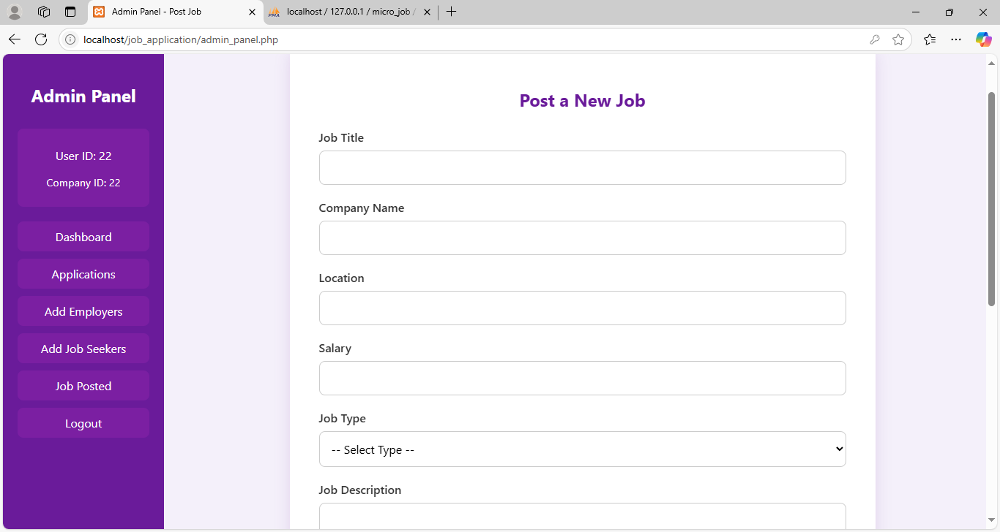
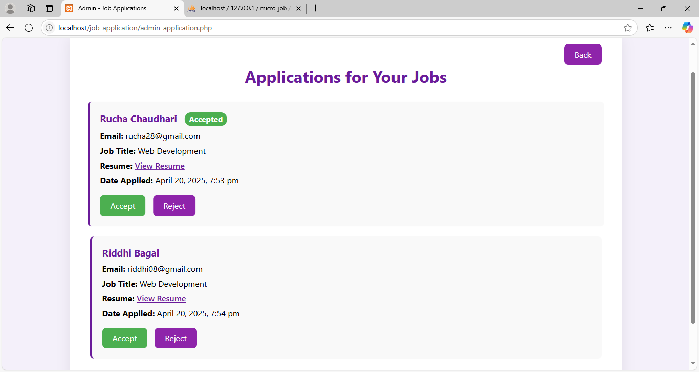
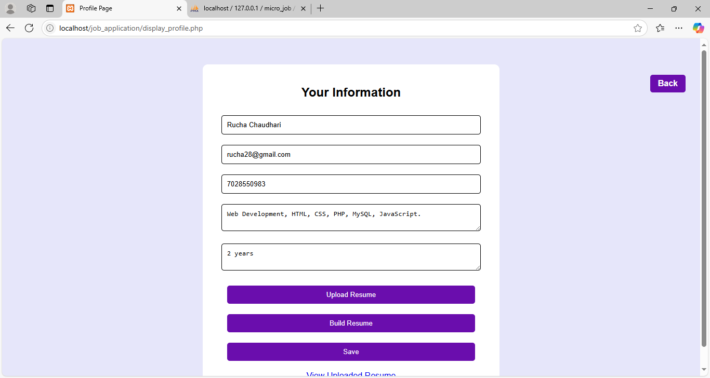
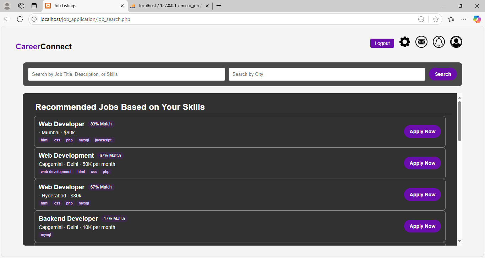
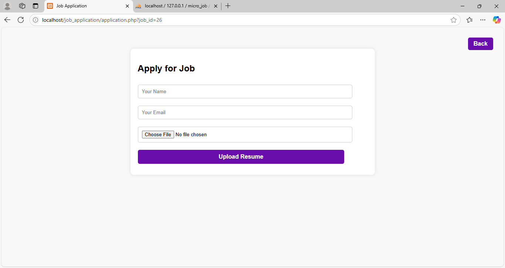

# 💼 Job Application Portal

A complete Job Application Portal built using HTML, CSS, JavaScript, PHP, and MySQL – designed to help Admins and Users seamlessly interact in a job-seeking and hiring environment!
## And to exerience it fully in action start from front.php

---

## 🔐 Admin Panel Features

### 👨‍💼 1. Job Posting Form

- Admins can post job opportunities using a simple form.
- These job postings appear in the User Panel for applicants to view and apply.

### 📄 2. Application Management

- View all the applications submitted by users.
- Accept or reject applications with a click!

### 🧑‍💻 3. Manage Job Seekers & Employers

- Add, view, and manage both job-seeking users and company employers.

### 📜 4. Job Post History

- A complete archive of all previously posted jobs is available in the Job Post tab.

---

## 👩‍💼 User Panel Features

### 👤 1. User Profile

- Users can add/edit their Name, Experience, Skills, and more.
- Upload a resume or build one online using the integrated Resume Builder.

### 🔎 2. Job Search Page

- View jobs posted by various companies.
- Get personalized job recommendations based on your profile skills.

### 📝 3. Apply for Jobs

- Fill out an application form and upload your resume.
- The application is sent directly to the company's admin.

### 🔔 4. Notifications

- All job updates and application alerts are displayed here in real-time.

### 💬 5. Inbox

- Communicate directly with employers.
- Accept or reject job offers based on your preferences.

### 📄 6. Job Detail View

- Access detailed information about job postings, including:
  - Job Title
  - Company Information
  - Job Description
  - Required Qualifications

---

## 🛠️ Technologies Used

- 🌐 **Frontend**: HTML, CSS, JavaScript
- 🧠 **Backend**: PHP
- 🗄️ **Database**: MySQL
- 🖥️ **Local Server**: XAMPP

---

## 📂 Project Setup Instructions

1. Clone the repository:
